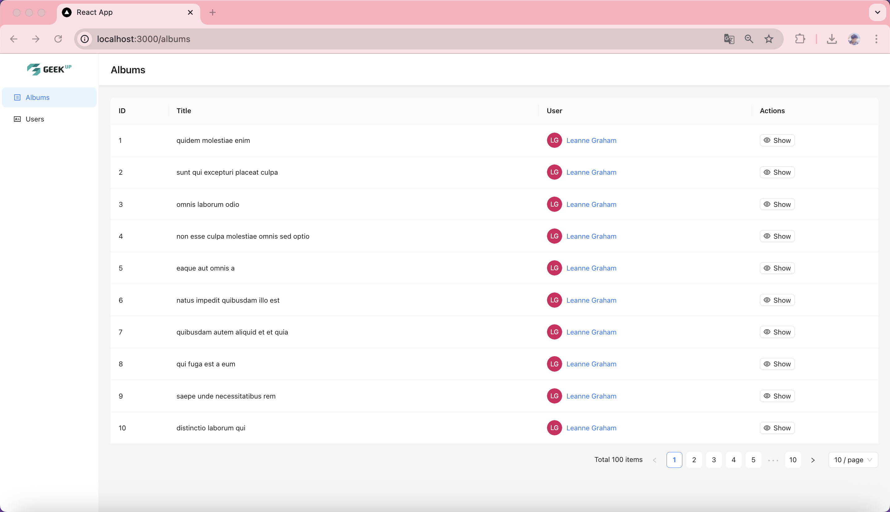
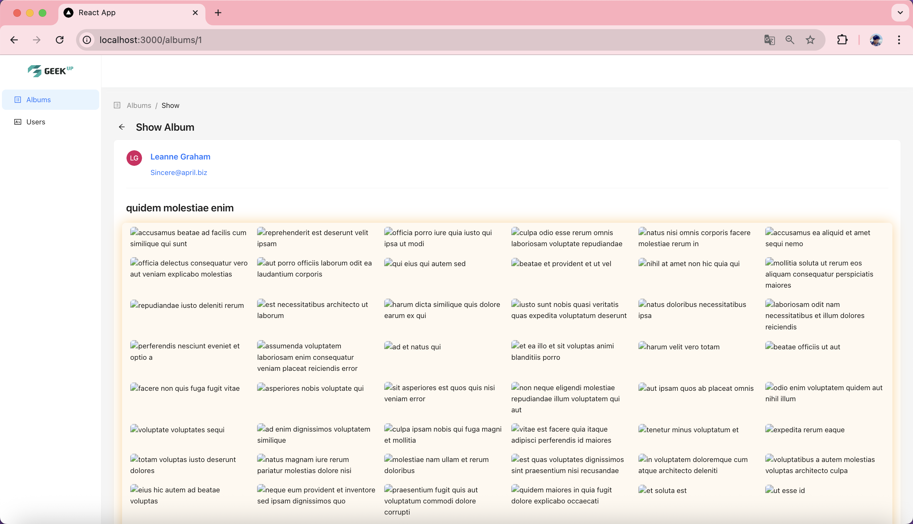
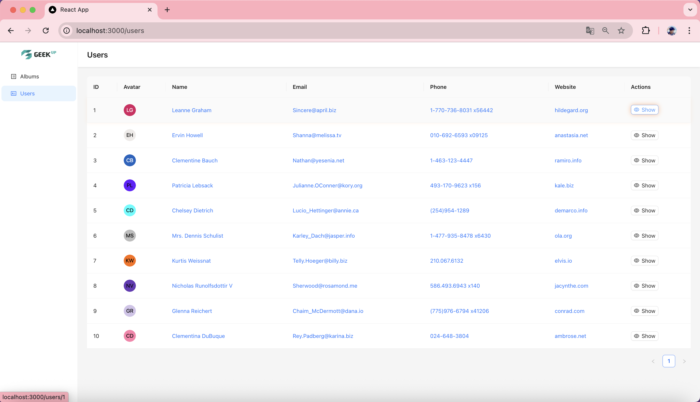
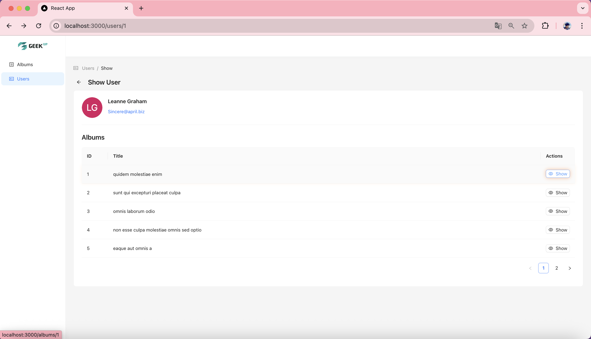

# 🎨 Gi-PF - Albums & Users

**Product Frontend – Geek Internship Summer 2025 Submission**

---

## 🚀 Project Setup Guide

Follow the steps below to run this React project on your local machine.

---

### ✅ Step 1: Install Dependencies

Install all required packages:

```bash
npm install
````

---

### ✅ Step 2: Start the Project

After dependencies are installed, run:

```bash
npm start
```

---

### 🛠️ If You See `react-scripts: command not found`

This error means `react-scripts` is not installed correctly.

1. Open `package.json` and check for `react-scripts` in the dependencies:

   ```json
   "dependencies": {
     "react": "^18.x.x",
     "react-dom": "^18.x.x",
     "react-scripts": "5.0.1"
   }
   ```

2. If it's missing, run:

   ```bash
   npm install react-scripts
   ```

---

### 🔁 If It Still Doesn't Work

Try clearing the cache and reinstalling everything:

```bash
rm -rf node_modules package-lock.json
npm install
```

Then restart the app:

```bash
npm start
```

---

### 📌 Node & npm Version Check

Make sure your environment is compatible:

```bash
node -v
npm -v
```

> ✅ Recommended: **Node.js v16 or v18**

---

## 🖼️ Application UI Preview

Below are some screenshots of the application interface:

### 📁 Albums Page



### 📂 Show Album



### 👥 Users Page



### 👤 Show User



---

## 🙋 Author

**La Hiểu Phong**
* 🎓 Geek Internship Summer 2025
* 📧 Email: [hieuphong144@gmail.com](mailto:hieuphong144@gmail.com)
* 🌐 Facebook: [facebook.com/lahieuphong2111](https://www.facebook.com/lahieuphong2111)

---

Made with ❤️ for **Geek Internship Summer 2025**
